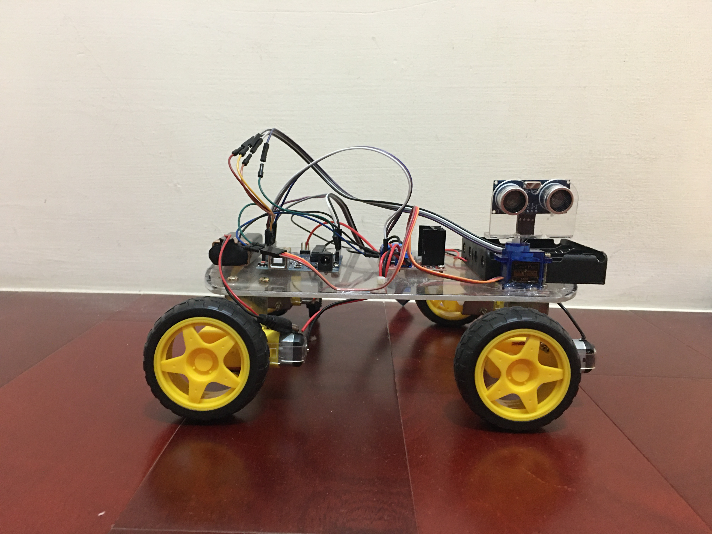

#  自製 Arduino 控制車，自動停車系統
此專案為利用Arduino製作一台控制車，並且擁有自動停車的功能，在main資料夾裡有此專案的原始碼在此repo中還有一份作品說明書，為此作品之實作詳細過程說明。
## 作品摘要
人們在進行停車時，常常無法拿捏好停車格的距離，本研究是將現實問題縮
小，並進行小型模擬來實驗車子在哪個位置中需要使用多少輪差和在限定空間
內進行安全且快速的停車，此方面由超音波感測器進行感測，並傳回到 Arduino 
UNO 開發版對前後兩台車的車距進行運算，進而做出停車判斷，若此距離可進
行停車，則會自動控制車子本體移動到適當的位置進行停車，若無法進行停
車，則會用其他方式進行停車。作品使用藍芽與手機進行連接，所以能進一步
使用手機控制 Arduino 車子 (此部分為車子到達目的地時的操控)。
## 獲獎紀錄
- 新北市立中和高中校內科展優等獎
## 作品照片

